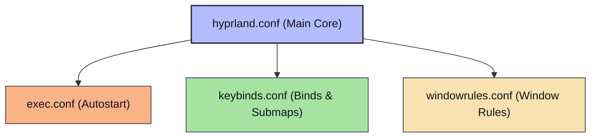

# Architecture Documentation

This document describes the architectural layout, configuration hierarchy, startup sequence, script interaction pattern, and dependencies of the `hypr-dots` desktop environment.

---

## Configuration Hierarchy

The configurations in this repository are designed to be modular. Instead of a single monolithic configuration, settings are split into specialized files and composed at runtime.

### Hyprland Composition
At startup, Hyprland reads the main configuration file `hyprland.conf` which defines core hardware settings, variables, and styling. At the bottom of the file, it imports other modular components in a strict order:



> [!IMPORTANT]
> The source directives must remain at the very bottom of `hyprland.conf`. Sourced files (especially `keybinds.conf`) reference variables (like `$terminal`, `$fileManager`, and `$menu`) that must be defined first in `hyprland.conf`.

### Waybar Composition
Waybar uses a two-level structure for both its configurations (JSON) and layouts (CSS):

1. **Configuration JSON (`config.jsonc`)**:
   - Includes layout fragments from `modules/left.jsonc` (workspaces, active window title).
   - Includes layout fragments from `modules/center.jsonc` (clock, custom night mode, custom DND).
   - Includes layout fragments from `modules/right.jsonc` (ordered list of system modules).
   - Loads module definitions from `modules/system.jsonc` (built-in CPU, memory, battery, etc.) and `modules/custom.jsonc` (custom scripts).

2. **Styling CSS (`style.css`)**:
   - Imports `styles/base.css` (Catppuccin Mocha colors as CSS variables + root resets).
   - Imports `styles/modules.css` (individual module styles, colors, and hover effects).
   - Imports `styles/states.css` (state-dependent styles like low battery or muted audio, plus blink animations).
   - Imports `styles/workspaces.css` (workspace button styling and layout).

---

## Startup Sequence

Applications and services are launched sequentially via `exec-once` directives in [exec.conf](../config/hypr/exec.conf). The startup sequence is ordered as follows:

| Order | Command / Service | Description | Why It's Needed |
| :--- | :--- | :--- | :--- |
| **1** | `nm-applet` | NetworkManager Applet | Provides the system tray network indicator and network selector. |
| **2** | `blueman-applet` | Bluetooth Manager Applet | Provides the system tray Bluetooth controls and connection status. |
| **3** | `waybar` | Status Bar | Renders the primary user interface bar (workspaces, system status, clock). |
| **4** | `hyprsunset` | Night Light filter | Starts the blue-light/temperature filter to protect eyes. Starts enabled. |
| **5** | `/usr/lib/polkit-kde-authentication-agent-1` | Polkit Authentication Agent | Handles graphical permission escalation dialogs (e.g., when launching package managers). |
| **6** | `wl-paste --type text --watch cliphist store` | Clipboard Manager (Text) | Monitors clipboard copy actions and stores text snippets in `cliphist`. |
| **7** | `wl-paste --type image --watch cliphist store` | Clipboard Manager (Images) | Monitors clipboard copy actions and stores image captures in `cliphist`. |
| **8** | `hypridle` | Idle Management | Runs in the background to lock, turn off monitors, or suspend after inactivity. |
| **9** | `wpaperd` | Wallpaper Daemon | Starts the active wallpaper rotation daemon. (Note: `hyprpaper` is disabled). |

---

## Theme System

The repository utilizes the **Catppuccin Mocha** palette across all UI elements for a unified look.

- **Status Bar (Waybar)**: Canonical CSS variables are defined in [base.css](../config/waybar/styles/base.css) (e.g., `@base`, `@mantle`, `@text`, `@blue`, `@green`). Colors are mapped to modules in `modules.css` using these variables.
- **Terminal (Kitty)**: Color definitions are hardcoded as `color0` through `color15` inside [kitty.conf](../config/kitty/kitty.conf) to match the Mocha palette.
- **Compositor (Hyprland)**: Border colors are hardcoded as gradient hex values inside [hyprland.conf border settings](../config/hypr/hyprland.conf) (`rgba(33ccffee)` and `rgba(00ff99ee)`).
- **Notifications (Mako)**: Mako has a blank configuration file, meaning it falls back to the default desktop behavior or user system defaults.

> [!WARNING]
> Theme configuration is distributed. There is no automated script to update colors across all four files. If a new color palette is introduced, it must be changed manually in `base.css`, `kitty.conf`, and `hyprland.conf`.

---

## Script Execution Flow

Custom integrations use a **Toggle/Status Script Pattern** to connect the Waybar status bar and keybinds to background CLI tools.

### Communication Pattern
For custom toggleable modules (such as Night Mode or Do Not Disturb):

1. **Waybar Custom Module**: Configured in [custom.jsonc](../config/waybar/modules/custom.jsonc) with `"return-type": "json"`. It runs a status script at intervals or listens to a system signal.
2. **Status Script**: Runs periodically, checks process state, and outputs JSON with text, tooltip, and CSS class (e.g. `{"text":"󰖔","tooltip":"Hyprsunset Enabled","class":"enabled"}`).
3. **Toggle Script**: Kills or starts the target daemon, waits briefly, and executes `pkill -RTMIN+N waybar` to force Waybar to instantly refresh the corresponding module.
4. **Keybinding**: Sourced keybinds trigger the toggle script, which automatically updates the status bar as a result.

### Signal Allocations
To avoid conflicts, Waybar signals (`RTMIN+N`) must be unique:

| Signal | Custom Module | Toggle Script | Status Script |
| :--- | :--- | :--- | :--- |
| `RTMIN+2` | `custom/hyprsunset` | `hyprsunset-toggle.sh` | `hyprsunset-status.sh` |
| `RTMIN+3` | `custom/dnd` | `mako-dnd-toggle.sh` | `mako-dnd-status.sh` |
| `RTMIN+4` | *(Next available)* | — | — |

---

## Component Dependencies

The diagram below illustrates how components interact and rely on each other:

```
+--------------------------------------------------------+
|                      User Input                        |
+---------------------------+----------------------------+
                            |
                            v
+---------------------------+----------------------------+
|                       Hyprland                         |
+-----+--------------+--------------+--------------+-----+
      |              |              |              |
      v              v              v              v
+-----+----+   +-----+----+   +-----+----+   +-----+----+
| Keybinds |   |  Exec    |   | Rules    |   |  Idle    |
+-----+----+   +-----+----+   +-----+----+   +-----+----+
      |              |                             |
      |              | +---------------------------+
      |              | |
      v              v v
+-----+--------------+-+--+
| Scripts / System Utils  | <---+ (Signals: RTMIN+N)
+-----+--------------+----+     |
      |              |          |
      v              v          |
+-----+----+   +-----+----+     |
|   Mako   |   |  Waybar  | ----+
+----------+   +----------+
```

---

## Shared Resources

- **Fonts**: `JetBrainsMono Nerd Font` must be installed. It is used as the monospace font in Kitty, Waybar icon formatting, and Hyprlock text layouts.
- **Wallpapers**: Static wallpapers must be saved in `~/Pictures/wallpapers/`. The active wallpaper rotating configuration in `wpaperd` expects this path.
- **Live Wallpaper**: The toggle live wallpaper script expects a video file located at `~/Pictures/live-wallpapers/stone-bridge.mp4`.
- **Screenshots**: Screens taken using print key combinations are saved to `~/Pictures/`.

---

## Runtime Assumptions

1. **Hardware**: Single built-in laptop screen (`eDP-1`, 1080p @ 60Hz).
2. **OS**: Arch Linux with systemd, using `pacman` as the package manager.
3. **Audio**: PipeWire/WirePlumber, using `wpctl` command bindings.
4. **Network**: NetworkManager backend, with `nm-applet` tray manager.
5. **Bluetooth**: BlueZ stack, with `blueman-applet` GUI.
6. **Daemons**: `ydotoold` system service must be enabled/running for the mouse-simulation keybind submap to work.
